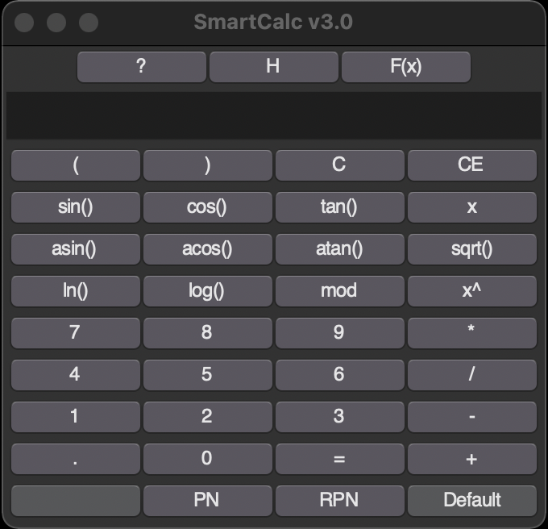
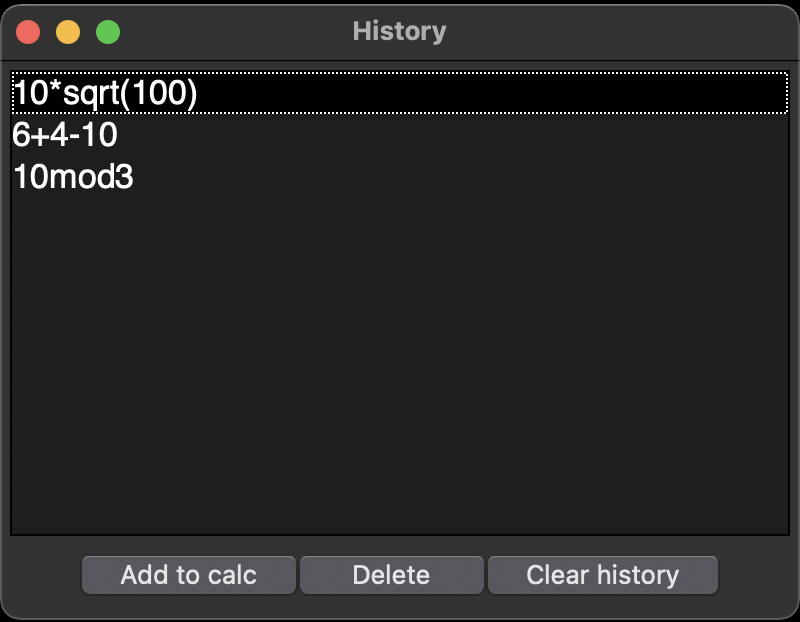
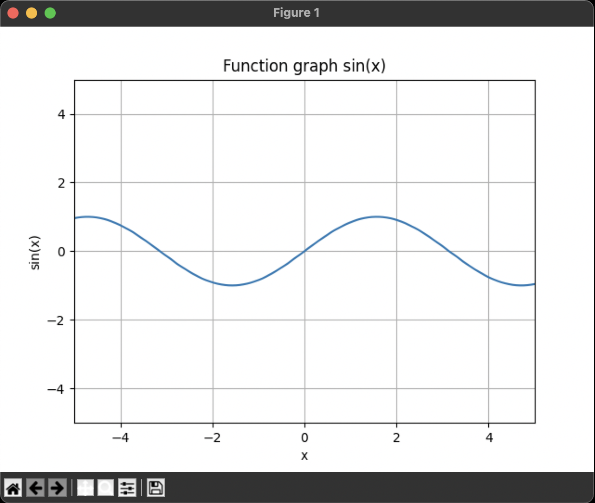

SMART CALC
=====================
Больше калькуляторов богу калькуляторов!   
Базовые и инженерные функции, понятный интерфейс и удобные фичи:
- История
- Графики функций
- Польские нотации

## Быстрый старт
1. Для установки зависимостей вы можете использовать `poetry install` (в случае если у вас есть [Poetry](https://python-poetry.org/)) или по классике `pip install -r requirements.txt`
2. Для установки калькулятора (MacOS) зайдите в директорию smartcalc и введите `python install_script.py`/ для запуска калькулятора без установки введите `python main.py`

Скрипт запросит путь для установки, по умолчанию она будет произведена в директорию **/Applications**.   
Так же будет будет представлена возможность создать ярлык на рабочем столее, по умолчанию ярлык не создаётся.

## Главное окно
  

### Меню
- `H` - переведёт вас в окно с историей запросов. В нём будет скроллбар с историей, а так же возможность добавить запрос в поле ввода калькулятора, удалить его из истории, или же вовсе _очистить всю историю_.
  
- `F(x)` - запустит построение графика (необходимое условие - в поле ввода калькулятора должен быть x). После нажатия будут запрошены области значений и определений.
  
- `?` - откроет окно с краткой инструкцией по работе с калькулятором.
### Режимы
>[!IMPORTANT]
>Переход между режимами очищает поле ввода калькулятора.
- `Default` - возвращает в стандартный режим работы калькулятора.
- `PN` (Polish Notation) - режим работы с выражениями в Польской нотации. Сначала пишутся операторы, потом операнды.
Пример: "+ 4 5"
- `RPN` (Reverse Polish Notation) - режим работы с выражениями в Обратной Польской нотации. Сначала пишутся операнды, потом операторы.
Пример: "48 6 -"
- `  ` - ставит в поле ввода пробел. Доступна только если нажаты PN или RPN. Его нужно ставить между каждым оператором и операндом в выражениях в Польских нотациях. 

>[!NOTE]
> Пробел необходим для того, чтобы калькулятор различал использование унарных знаков и вычисление выражений в Польских нотациях.  
Пример: "+32" может значить как унарный плюс к тридцати двум, так и три плюс два.

## Завершение
Благодарю читателя за интерес к моему проекту, буду рад вашему фидбеку.
